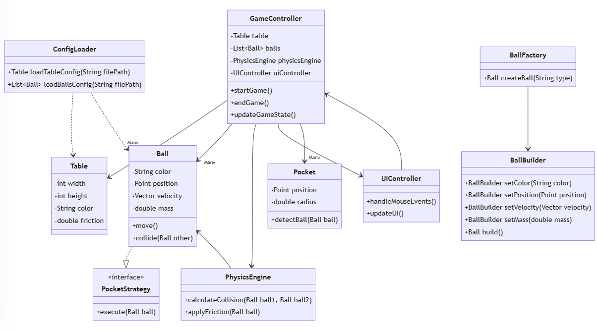
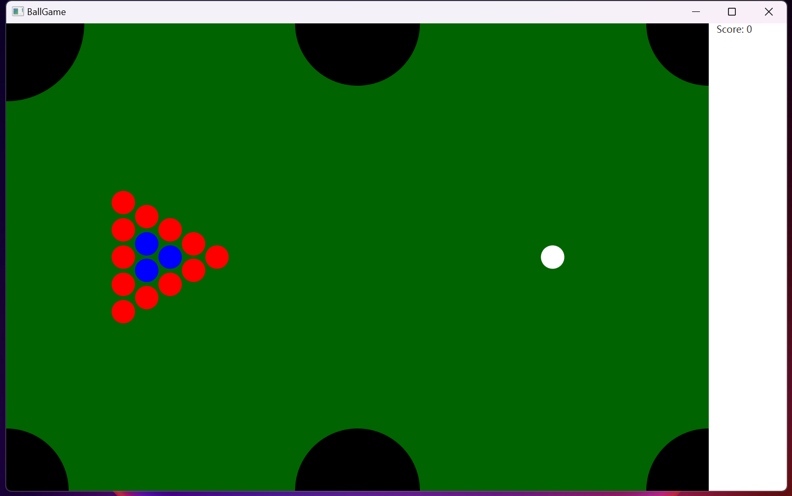

### 项目配置
1. 初始化项目
`gradle init --type java-application`
>默认选项即可
2. vscode 打开APP文件夹
3. 编辑 build.gradle 文件
```Groovy
plugins {
    // Apply the application plugin to add support for building a CLI application in Java.
    id 'application'
    id 'org.openjfx.javafxplugin' version '0.0.13'
}

repositories {
    // Use Maven Central for resolving dependencies.
    mavenCentral()
}

javafx {
    version = "17.0.2"
    modules = ['javafx.controls','javafx.media']
}


application {
    // Define the main class for the application.
    mainClass = 'boolgame.App'
}
```
4. 编辑 App.java 文件
```
package boolgame;

import javafx.application.Application;
import javafx.scene.Scene;
import javafx.scene.layout.StackPane;
import javafx.stage.Stage;

public class App extends Application {

    @Override
    public void start(Stage primaryStage) {
        StackPane root = new StackPane();
        Scene scene = new Scene(root, 300, 250);

        primaryStage.setTitle("Hello JavaFX");
        primaryStage.setScene(scene);
        primaryStage.show();
    }

    public static void main(String[] args) {
        launch(args);
    }
}

```
5. 启动 gradle run
### 项目设计
1. 主要类和组件
GameController：控制游戏的主要逻辑，比如开始、结束游戏，以及游戏状态的更新。
Table：表示球桌，包括尺寸、颜色和摩擦力。
Ball：表示球，包括颜色、位置、速度和质量。
Pocket：表示球袋，用于检测球是否进入。
BallFactory：用于根据配置文件创建球的工厂类。
BallBuilder：用于构建球的建造者类。
PocketStrategy：定义球进入袋后的行为的策略接口。
PhysicsEngine：处理球的运动、碰撞和动量变化的物理引擎。
UIController：负责处理用户界面交互，如鼠标操作。
ConfigLoader：负责从 JSON 文件加载配置。
2. 类之间的关系
GameController 依赖于 Table、Ball（包括特定类型的球，如 WhiteBall、RedBall、BlueBall）、Pocket、PhysicsEngine 和 UIController。
BallFactory 使用 BallBuilder 来创建 Ball 实例。
Ball 实现了 PocketStrategy 接口，以定义不同类型的球进入球袋后的行为。
PhysicsEngine 负责处理 Ball 的动态交互。
UIController 与 GameController 互动，转换用户输入为游戏动作。
ConfigLoader 被用于初始化游戏配置，如 Table 和 Ball 的属性。

### 项目实施
