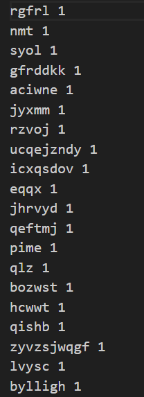

# Lab5 MapReduce 实验报告
## Part A: RPC
### 1. Software Setup
##### 实验目标
To use GoRPC, you first need to install the Go language in your environment:
```shell
sudo apt-get install golang
go version
``` 
##### 实验结果

### 2. Services and RPCs
##### GoRPC 调用模型

#### Exercise 1
##### 实验目标
In this part, we will create a square server using RPC. The client will send a number, and the server will square the number and return the result to the client.
##### 实验要求
Read the code in partA/square folder and fill the missing code in square-client.c and square-server.c.
##### 源代码
```C
int square(int x) {
    return x * x;
}
```
##### 实验结果

#### Exercise 2
##### 实验目标
Next, we will implement a feature to count the number of words in a string. The string-client will send hello, world to the string-service, and the string-server will count the number of words and return the result.
##### 实验要求
Read the assigned code string-service.c, and complete string-count functions
##### 设计思路
只识别每个单词的开始点，并且每次遇到新单词时递增计数器。不关心单词的结束点，每个单词仅在开始时被识别。
##### 程序说明

##### 源代码
```C
int CountString(char *str) {
    int count = 0;
    char prev = ' ';
    while (*str) {
        if (!isspace((unsigned char)*str) && isspace((unsigned char)prev)) {
            ++count;
        }
        prev = *str++;
    }
    return count;
}
```
##### 实验结果

#### Exercise 3
##### 实验目标
Similarly, we can also implement RPC-based cloud data structures. For example, you can design a stack and some of its operations on the server side and try to call it on the client side.
##### 实验要求 
Complete the code in stack-server.h and stack-server.s. Make sure your code passed the test in stack-client.c.
##### 设计思路
一个典型的链栈（Stack）数据结构的实现，使用链表来存储数据。栈是通过动态分配的节点（node_t）来管理的，每个节点包含一个值和一个指向下一个节点的指针。这种设计允许栈动态地增长和缩小，而不需要预先分配一个固定大小的空间。
##### 程序说明
###### stack_push

###### stack_pop

###### stack_size

##### 源代码
```C
void stack_push(int value) {
    node_t *p = (node_t *)malloc(sizeof(node_t));
    p->value = value;
    p->next = stack.top;
    stack.top = p;
}

int stack_pop() {
    int value = -1;
    node_t *p = stack.top;
    if (p == NULL)
        return -1;
    stack.top = p->next;
    value = p->value;
    free(p);
    return value;
}

int stack_size() {
    int size = 0;
    node_t *p = stack.top;
    while (p != NULL) {
        size++;
        p = p->next;
    }
    return size;
}
```
##### 实验结果

### 3. Concurrency and Locks
#### Exercise 1
##### 实验要求
Compile and run the code in the folder partA/count, compile and run the code. What is your output? What is the expected output? How does this output generated?
#### 实验结果

#### Exercise 2
##### 实验要求
Modify the code in the partA/count folder, to protect the shared variable with mutex. Compile and run your code, what is the output?
##### 设计思路
程序初始化时申请一个互斥锁，在进入临界区时上锁，退出临界区时解锁。保证互斥访问临界区。这里临界区就是访问 count 变量的代码。
##### 源代码
```C
#include <pthread.h>

int count = 0;
pthread_mutex_t mu;

void initmutex() {
    pthread_mutex_init(&mu, NULL);
}

int increment() {
    pthread_mutex_lock(&mu);
    count++;
    pthread_mutex_unlock(&mu);
    return count;
}

int decrement() {
    pthread_mutex_lock(&mu);
    count--;
    pthread_mutex_unlock(&mu);
    return count;
}

int get_count() {
    return count;
}
```
##### 实验结果

#### Exercise 3
##### 实验目标
When there are multiple clients or multiple threads accessing the sever, the stack of the RPC implementation also has data competition, so we need to use some methods to ensure data security
##### 实验要求
Improve the code in stack-server.h and stack-server.s. Make sure your code passed the test in constack-client.c.
##### 设计思路
程序初始化时申请一个互斥锁，在进入临界区时上锁，退出临界区时解锁。保证互斥访问临界区。这里临界区就是访问 top 变量的代码。
##### 源代码
```C
#include "stack-server.h"
#include <stdio.h>
#include <stdlib.h>

stack_t stack;

void stack_init() {
    pthread_mutex_init(&stack.mu, NULL);
    return;
}

void stack_push(int value) {
    pthread_mutex_lock(&stack.mu);
    node_t *p = (node_t *)malloc(sizeof(node_t));
    p->value = value;
    p->next = stack.top;
    stack.top = p;
    pthread_mutex_unlock(&stack.mu);
}

int stack_pop() {
    int value = -1;
    pthread_mutex_lock(&stack.mu);
    node_t *p = stack.top;
    if (p == NULL)
        return -1;
    stack.top = p->next;
    value = p->value;
    free(p);
    pthread_mutex_unlock(&stack.mu);

    return value;
}

int stack_size() {
    int size = 0;
    pthread_mutex_lock(&stack.mu);
    node_t *p = stack.top;
    while (p != NULL) {
        size++;
        p = p->next;
    }
    pthread_mutex_unlock(&stack.mu);
    return size;
}
```
stack-server.go 中要加一行 C.stack_init()
```go
func main() {
	fmt.Println("server started...")
	server()
	C.stack_init()
}
```
##### 实验结果

## Part B: MapReduce
### 1. Sequential MapReduce
##### 实验目标
Check the file-struct.h file for details of the function declarations. And, in conjunction with the two diagrams below, understand the data structure of single-threaded MapReduce.
##### 实验要求
Complete the map_phase and reduce_phase functions in the seq-mr.c file to implement the functionality of single-threaded MapReduce.
##### 设计思路
实现是MapReduce模型的一个简化版。它主要用于处理文本文件，通过Map阶段生成键值对，然后在Reduce阶段对这些键值对进行处理。整个过程中，考虑了文件操作、内存管理以及错误处理。这个实现是顺序执行的，并未包含并行或分布式处理的元素。
1. map_phase 函数
输入处理：此函数接收一个文件节点数组和输入输出文件的数量。它遍历每个输入文件，读取文件内容到缓冲区。
Map操作：对每个读取的文件内容执行mr_map函数，该函数应该实现具体的Map逻辑，如分析文本数据，生成键值对（key-value pairs，简称 kv）列表。
文件写入：每个Map任务为每个Reduce任务创建一个临时文件，用于存储Map结果。键值对根据其键的哈希值分配到对应的Reduce任务文件中。
资源管理：Map操作完成后，释放kv列表所占用的内存，并关闭所有打开的文件。
2. reduce_phase 函数
文件读取：此函数遍历每个Reduce任务。对于每个任务，它打开所有分配给该Reduce任务的临时文件，并读取其中的键值对。
Reduce操作：读取的键值对列表首先按键排序，然后对于每个唯一键，调用mr_reduce函数执行Reduce操作。此函数应实现具体的Reduce逻辑，如聚合或汇总数据。
结果输出：Reduce操作的结果写入最终输出文件。
资源管理：和Map阶段类似，释放所有分配的内存，并关闭所有打开的文件。
3. kvcmp 函数
排序逻辑：这是一个辅助函数，用于在Reduce阶段中对键值对进行排序。它简单地比较两个键值对中的键。
##### 程序说明
1. map_phase

2. reduce_phase

##### 源代码
1. map_phase
```C
void map_phase(fnode *node, int nInput, int nOutputs) {
    // 遍历每个 map worker，一个 worker 分配一个文件，因为是顺序执行
    for (int i = 0; i < nInput; ++i) {

        printf("map%d start\n", i);

        file_list current_file_list = node->files[i]; // 当前处理的文件

        // 读输入文件到缓冲区
        char path_name[256];
        sprintf(path_name, "%s%s", INPUT_DIR, current_file_list.fname); // 当前处理的文件路径
        char *buf = read_file(path_name);
        // map 产生 kv列表，要释放
        list_t kvs = mr_map(buf);

        // 申请nOutputs个文件，命名方式为 M-R.txt，M代表Map号，R代表Reduce号
        FILE **fp = (FILE **)calloc(nOutputs, sizeof(FILE *));
        
        char path[256];
        printf("create file: ");
        for (int j = 0; j < nOutputs; j++) {
            sprintf(path, "%s%d_%d.txt", TMP_DIR, i, j);
            printf("%s ", path);
            // node->files->inter->file_paths[j] = strdup(path); // 同上,耦合性太强
            fp[j] = fopen(path, "w");
            if (fp[j] == NULL) {
                perror("fopen");
                exit(EXIT_FAILURE);
            }
        }
        printf("\n");

        // 遍历kvs，对每一个key映射到 reduce 任务号，从而放到不同的文件中
        for (int i = 0; i < kvs->last; i++) {
            unsigned int rid = djb_hash(((kv_t)kvs->containter[i])->key) % nOutputs;
            fprintf(fp[rid], "%s %s\n", ((kv_t)kvs->containter[i])->key, ((kv_t)kvs->containter[i])->value);
        }

        // 释放kv内存
        for (int i = 0; i < kvs->last; i++) {
            kv_free(kvs->containter[i]);
        }
        free(kvs->containter);
        free(kvs);

        // 关闭文件
        for (int j = 0; j < nOutputs; j++) {
            fclose(fp[j]);
        }
        printf("map%d end\n", i);
    }
}
```
1. reduce_phase
```C
void reduce_phase(fnode *node, int nInput, int nOutputs) {

    // 模拟每个reduce的worker
    for (int i = 0; i < nOutputs; i++) {

        printf("reduce%d start\n", i);

        // 读取所有的要reduce的文件到一个列表
        list_t kvs = list_new();
        // 遍历每个属于该reduce的文件,j是map号
        printf("open file: ");
        for (int j = 0; j < nInput; j++) {
            char path[256];
            sprintf(path, "%s%d_%d.txt", TMP_DIR, j, i);
            printf("%s ", path);
            FILE *fp = fopen(path, "r");
            if (fp == NULL) {
                perror("fopen");
                exit(EXIT_FAILURE);
            }
            char k[20], v[20]; // 单词的长度是[3,10]，generate-words.py 里有写
            while (fscanf(fp, "%s %s", k, v) != EOF) {
                kv_t kv = kv_new(k, v); // free?
                list_append(kvs, kv);
            }
            fclose(fp);
        }
        printf("\n");

        // 对 kvs 按照key进行排序
        qsort(kvs->containter, kvs->last, sizeof(kvs->containter[0]), kvcmp);

        list_t tmplist = list_new();
        char *cur_key;
        char path[256];
        sprintf(path, "%s%d.txt", OUTPUT_DIR, i);
        printf("create file: %s\n", path);
        FILE *fp = fopen(path, "w");
        if (fp == NULL) {
            perror("fopen");
            exit(EXIT_FAILURE);
        }
        for (int j = 0; j < kvs->last; j++) {
            if (j == 0) {
                cur_key = (((kv_t)kvs->containter[j])->key);
                list_append(tmplist, ((kv_t)kvs->containter[j])->value);
            } else {
                if (strcmp(((kv_t)kvs->containter[j])->key, cur_key) == 0)
                    list_append(tmplist, ((kv_t)kvs->containter[j])->value);
                else {
                    char *ans = mr_reduce(cur_key, tmplist);
                    // printf("%s,%s\n", cur_key, ans);
                    fprintf(fp, "%s %s\n", cur_key, ans);
                    cur_key = (((kv_t)kvs->containter[j])->key);
                    free(tmplist->containter);
                    free(tmplist);
                    tmplist = list_new();
                    list_append(tmplist, ((kv_t)kvs->containter[j])->value);
                }
            }
        }
        char *ans = mr_reduce(cur_key, tmplist);
        // printf("%s,%s\n", cur_key, ans);
        fprintf(fp, "%s %s\n", cur_key, ans);

        fclose(fp); // 关闭文件
        // 释放内存
        for (int i = 0; i < kvs->last; i++) {
            kv_free(kvs->containter[i]);
        }
        free(kvs->containter);
        free(kvs);
        free(tmplist->containter);
        free(tmplist);

        printf("reduce%d end\n", i);
    }
}
```
1. kvcmp
```C
int kvcmp(const void *a, const void *b) { // kvs排序函数
    return strcmp((*(kv_t *)a)->key, (*(kv_t *)b)->key);
}
```
##### 实验结果
1. 生成数据
   
   
2. 将用户程序(词频统计)制作成动态链接库
   
3. 编译mapreduce框架生成可执行程序
   
4. mapreduce框架执行用户程序
   
5. 执行程序
   
6. 执行结果
7. **./output/0.txt**
   
   **./tmp/0_0.txt**
   
### 2. Concurrent MapReduce
#### Exercise 2
##### 实验目标
Sequential MapReduce involves the use of a single thread to sequentially execute Map and Reduce functions. In this section, you will be implementing Map and Reduce using a multi-threaded model, and you will need to design appropriate data structures to address data synchronization challenges in concurrent processing.
##### 实验要求
Design your data structures and implement thread communication and synchronization for concurrent processing, to complete MapReduce in a multi-threaded single-machine environment.
##### 设计思路
###### 概述
本实验旨在实现一个多线程版本的 MapReduce 系统。核心目标是通过线程池的使用，将每个线程视作一个独立的工作单元（Worker），以有效地管理和执行分配给线程池的任务。
###### 线程池调度
实验的设计基于创建一个线程池，其中每个线程承担了 Worker 的角色。整个实验流程分为两个主要阶段：
Map 阶段：在此阶段，maptask 任务被添加到线程池的任务队列中。所有的 maptask 完成后，程序进入下一阶段。
Reduce 阶段：在此阶段，reducetask 任务被添加到线程池。待所有 reducetask 完成后，线程池关闭，标志着整个 MapReduce 任务的完成。
###### 线程池实现
在实现过程中，遇到的主要挑战是线程池的设计和实现。最初尝试自行实现一个简单的线程池，但不幸遭遇了一些难以解决的技术障碍。为了确保实验的顺利进展和整体项目的稳定性，最终决定采用一个经过验证的线程池库，该库从 GitHub 获取。这一决策不仅加速了开发进程，还提高了系统的稳定性和可靠性。
##### 程序说明
maptask 和 reducetask，就是去除 for 循环后的 Sequential MapReduce 的 map_phase 和 reduce_phase

##### 源代码
1. maptask
```C
// 线程应该执行的map任务，基本同顺序化的map_phase，只是把for拆开成线程了
void maptask(void *arg) {
    int no = (int)(uintptr_t)arg; // map任务号
    printf("map%d start\n", no);
    char path_name[256];
    sprintf(path_name, "%s%s", INPUT_DIR, file_names[no]); // 当前处理的文件路径

    // 读输入文件到缓冲区
    char *buf = read_file(path_name);
    // map 产生 kv列表，要释放
    list_t kvs = mr_map(buf);

    // 申请result_size个文件，命名方式为 M-R.txt，M代表Map号，R代表Reduce号
    FILE **fp = (FILE **)calloc(result_size, sizeof(FILE *));

    char path[256];
    printf("create file: ");
    for (int j = 0; j < result_size; j++) {
        sprintf(path, "%s%d_%d.txt", TMP_DIR, no, j);
        printf("%s ", path);
        fp[j] = fopen(path, "w");
        if (fp[j] == NULL) {
            perror("fopen");
            exit(EXIT_FAILURE);
        }
    }
    printf("\n");

    // 遍历kvs，对每一个key映射到 reduce 任务号，从而放到不同的文件中
    for (int i = 0; i < kvs->last; i++) {
        unsigned int rid = djb_hash(((kv_t)kvs->containter[i])->key) % result_size;
        fprintf(fp[rid], "%s %s\n", ((kv_t)kvs->containter[i])->key, ((kv_t)kvs->containter[i])->value);
    }

    // 释放kv内存
    for (int i = 0; i < kvs->last; i++) {
        kv_free(kvs->containter[i]);
    }
    free(kvs->containter);
    free(kvs);

    // 关闭文件
    for (int j = 0; j < result_size; j++) {
        fclose(fp[j]);
    }
    printf("map%d end\n", no);
}
```
2. reducetask
```C
// 线程应该执行的reduce任务，基本同顺序化的reduce_phase，只是把for拆开成线程了
void reducetask(void *arg) {

    int no = (int)(uintptr_t)arg; // reduce任务号
    printf("reduce%d start\n", no);
    // 读取所有的要reduce的文件到一个列表
    list_t kvs = list_new();
    printf("open file: ");
    // 遍历每个属于该reduce的文件,j是map号
    for (int j = 0; j < task_size; j++) {
        char path[256];
        sprintf(path, "%s%d_%d.txt", TMP_DIR, j, no);
        printf("%s ", path);
        FILE *fp = fopen(path, "r");
        if (fp == NULL) {
            perror("fopen");
            exit(EXIT_FAILURE);
        }
        char k[20], v[20]; // 单词的长度是[3,10]，generate-words.py 里有写
        while (fscanf(fp, "%s %s", k, v) != EOF) {
            kv_t kv = kv_new(k, v); // free?
            list_append(kvs, kv);
        }
        fclose(fp);
    }
    printf("\n");

    // 对 kvs 按照key进行排序
    qsort(kvs->containter, kvs->last, sizeof(kvs->containter[0]), kvcmp);

    list_t tmplist = list_new();
    char *cur_key;
    char path[256];
    sprintf(path, "%s%d.txt", OUTPUT_DIR, no);
    printf("create file: %s\n", path);
    FILE *fp = fopen(path, "w");
    if (fp == NULL) {
        perror("fopen");
        exit(EXIT_FAILURE);
    }
    for (int j = 0; j < kvs->last; j++) {
        if (j == 0) {
            cur_key = (((kv_t)kvs->containter[j])->key);
            list_append(tmplist, ((kv_t)kvs->containter[j])->value);
        } else {
            if (strcmp(((kv_t)kvs->containter[j])->key, cur_key) == 0)
                list_append(tmplist, ((kv_t)kvs->containter[j])->value);
            else {
                char *ans = mr_reduce(cur_key, tmplist);
                // printf("%s,%s\n", cur_key, ans);
                fprintf(fp, "%s %s\n", cur_key, ans);
                cur_key = (((kv_t)kvs->containter[j])->key);
                free(tmplist->containter);
                free(tmplist);
                tmplist = list_new();
                list_append(tmplist, ((kv_t)kvs->containter[j])->value);
            }
        }
    }
    char *ans = mr_reduce(cur_key, tmplist);
    // printf("%s,%s\n", cur_key, ans);
    fprintf(fp, "%s %s\n", cur_key, ans);

    fclose(fp); // 关闭文件
    // 释放内存
    for (int i = 0; i < kvs->last; i++) {
        kv_free(kvs->containter[i]);
    }
    free(kvs->containter);
    free(kvs);
    free(tmplist->containter);
    free(tmplist);

    printf("reduce%d end\n", no);
}
```
3. main
```C
int main(int argc, char *argv[]) {

    if (argc < 5) { // 多了一个参数，线程数
        fprintf(stderr, "Usage: ./mthd-mr.out <libmr.so> <thread_size> <result_size> <file1> <file2> ... <fileN>\n");
        exit(0);
    }
    const char *libmr_so = argv[1];
    load_mr_library(libmr_so);   // 链接map和reduce库
    worker_size = atoi(argv[2]); // 线程数
    result_size = atoi(argv[3]); // reduce数
    task_size = argc - 4;        // map数

    file_names = (char **)calloc(task_size, sizeof(char *)); // 输入文件名数组
    for (int i = 4; i < argc; i++)                           // 保存文件名
        file_names[i - 4] = argv[i];

    system("rm -rf ./output && mkdir output"); // 重新设置输出文件夹
    system("rm -rf ./tmp && mkdir tmp");       // 重新设置中间文件夹

    threadpool thpool;
    if ((thpool = thpool_init(worker_size)) == NULL)
        perror("error:");

    puts("添加map任务");
    for (int i = 0; i < task_size; i++) {
        thpool_add_work(thpool, maptask, (void *)(uintptr_t)i);
    };

    thpool_wait(thpool);

    puts("添加reduce任务");
    for (int i = 0; i < result_size; i++) {
        thpool_add_work(thpool, reducetask, (void *)(uintptr_t)i);
    };
    thpool_wait(thpool);
    thpool_destroy(thpool);

    return 0;
}
```
##### 实验结果
1. 执行程序
    
    由于是多线程同时输出日志到屏幕，因此日志有点混乱
2. **./output/0.txt**
   
   **./tmp/0_0.txt**
   
### 3. Distributed MapReduce
#### Exercise 3
##### 实验目标
In practical environments, the threads responsible for MapReduce processing are often distributed across multiple servers, also known as workers. Workers initiate connection requests to the Master to request tasks, and the Master assigns Map or Reduce tasks to the workers, thus completing distributed MapReduce.
##### 实验要求
Implement distributed MapReduce using gorpc remote procedure calls. You need to design appropriate data structures to mitigate common conflicts and synchronization issues in a distributed context.
##### 设计思路
###### 概述
本实验旨在实现一个分布式 MapReduce 模型，划分为服务器（Server）和客户端（Client）。在这个模型中，服务器负责执行 Map 和 Reduce 任务，而客户端通过 GoRPC 远程调用这些函数。本实验的核心在于如何合理安排客户端对服务器的调用，以及如何有效地调度服务器资源。
###### 服务器端设计
服务器端设计包含了 map_phase 和 reduce_phase 两个关键函数，用于处理分布式系统中的 MapReduce 任务。在的实验设置中，有多个服务器实例，每个实例都能独立执行这些函数。
###### 客户端与服务器的交互
客户端通过 GoRPC 与服务器进行交互，远程调用 map_phase 和 reduce_phase 函数。关键的设计点在于如何映射和调度多个服务器端的资源。
###### 线程与服务器的绑定
采用了一种策略，将每个线程绑定到一个特定的服务器实例，这意味着每个线程只能调用与其绑定的特定服务器的 map_phase 或 reduce_phase 函数。这种设计实现了服务器与线程间的一一映射，从而将对服务器的调度转换为对线程的调度。
这种映射关系是通过 C11 特性 _Thread_local，实现的，每个线程在第一次进入时，在线程局部变量为其设置唯一的 id，对应 server 域名数组的下标。当然，用于给线程局部变量赋值的全局累加的 workerid 需要互斥锁保护。
###### 线程池的应用
由于 GoRPC 调用是阻塞的，一个线程在远程调用未完成时也会阻塞，并不会返回。这一特性使得线程池成为理想的调度方法。因此，采用了与多线程 MapReduce 类似的线程池方法来管理和调度这些线程。
###### 分布式文件系统的假设
为了简化实验模型，假设所有的文件存储在一个分布式文件系统（如 HDFS）上。这样，文件传输问题就不再是一个障碍，可以直接在本地文件系统上执行操作。
##### 程序说明
###### server
map_phase 和 reduce_phase，就是去除 for 循环后的 Sequential MapReduce 的 map_phase 和 reduce_phase
###### client
1. main
    基本同 Concurrent MapReduce 的 main
2. maptask
    发起 map(对应 server 端的 map_phase) RPC 调用的线程工作函数
3. reducetask
    发起 Reduce(对应 server 端的 reduce_phase) RPC 调用的线程工作函数
##### 源代码
###### server
1. map_phase
```C
void map_phrase(int no, int reduce_size) {
    char path_name[256];
    printf("map%d start\n", no);
    sprintf(path_name, "%s%c.txt", INPUT_DIR, (char)(no + 'a')); // 当前处理的文件路径
    // 读输入文件到缓冲区
    char *buf = read_file(path_name);
    // map 产生 kv列表，要释放
    list_t kvs = mr_map(buf);

    // 申请reduce_size个文件，命名方式为 M-R.txt，M代表Map号，R代表Reduce号
    FILE **fp = (FILE **)calloc(reduce_size, sizeof(FILE *));
    
    char path[256];
    printf("create file: ");
    for (int j = 0; j < reduce_size; j++) {
        sprintf(path, "%s%d_%d.txt", TMP_DIR, no, j);
        printf("%s ", path);
        fp[j] = fopen(path, "w");
        if (fp[j] == NULL) {
            perror("fopen");
            exit(EXIT_FAILURE);
        }
    }
    printf("\n");

    // 遍历kvs，对每一个key映射到 reduce 任务号，从而放到不同的文件中
    for (int i = 0; i < kvs->last; i++) {
        unsigned int rid = djb_hash(((kv_t)kvs->containter[i])->key) % reduce_size;
        fprintf(fp[rid], "%s %s\n", ((kv_t)kvs->containter[i])->key, ((kv_t)kvs->containter[i])->value);
    }

    // 释放kv内存
    for (int i = 0; i < kvs->last; i++) {
        kv_free(kvs->containter[i]);
    }
    free(kvs->containter);
    free(kvs);

    // 关闭文件
    for (int j = 0; j < reduce_size; j++) {
        fclose(fp[j]);
    }
    printf("map%d end\n", no);
}
```
1. reduce_phase
```C
void reduce_phrase(int no, int map_size) {
    printf("reduce%d start\n", no);
    list_t kvs = list_new();
    printf("open file: ");
    // 遍历每个属于该reduce的文件,j是map号
    for (int j = 0; j < map_size; j++) {
        char path[256];
        sprintf(path, "%s%d_%d.txt", TMP_DIR, j, no);
        printf("%s ", path);
        FILE *fp = fopen(path, "r");
        if (fp == NULL) {
            perror("fopen");
            exit(EXIT_FAILURE);
        }
        char k[20], v[20]; // 单词的长度是[3,10]，generate-words.py 里有写
        while (fscanf(fp, "%s %s", k, v) != EOF) {
            kv_t kv = kv_new(k, v); // free?
            list_append(kvs, kv);
        }
        fclose(fp);
    }
    printf("\n");

    // 对 kvs 按照key进行排序
    qsort(kvs->containter, kvs->last, sizeof(kvs->containter[0]), kvcmp);

    list_t tmplist = list_new();
    char *cur_key;
    char path[256];
    sprintf(path, "%s%d.txt", OUTPUT_DIR, no);
    printf("create file: %s\n", path);
    FILE *fp = fopen(path, "w");
    if (fp == NULL) {
        perror("fopen");
        exit(EXIT_FAILURE);
    }
    for (int j = 0; j < kvs->last; j++) {
        if (j == 0) {
            cur_key = (((kv_t)kvs->containter[j])->key);
            list_append(tmplist, ((kv_t)kvs->containter[j])->value);
        } else {
            if (strcmp(((kv_t)kvs->containter[j])->key, cur_key) == 0)
                list_append(tmplist, ((kv_t)kvs->containter[j])->value);
            else {
                char *ans = mr_reduce(cur_key, tmplist);
                // printf("%s,%s\n", cur_key, ans);
                fprintf(fp, "%s %s\n", cur_key, ans);
                cur_key = (((kv_t)kvs->containter[j])->key);
                free(tmplist->containter);
                free(tmplist);
                tmplist = list_new();
                list_append(tmplist, ((kv_t)kvs->containter[j])->value);
            }
        }
    }
    char *ans = mr_reduce(cur_key, tmplist);
    // printf("%s,%s\n", cur_key, ans);
    fprintf(fp, "%s %s\n", cur_key, ans);

    fclose(fp); // 关闭文件
    // 释放内存
    for (int i = 0; i < kvs->last; i++) {
        kv_free(kvs->containter[i]);
    }
    free(kvs->containter);
    free(kvs);
    free(tmplist->containter);
    free(tmplist);

    printf("reduce%d end\n", no);
}
```
###### client
1. main
```C
int main(int argc, char *argv[]) {
    if (argc < 5) {
        fprintf(stderr, "Usage: ./mr-client.out <result_size> <worker_size> <worker1> <worker2> ... <workerN> <file1> <file2> ... <fileN>\n");
        exit(0);
    }
    const char *libmr_so = argv[1];

    int worker_size = atoi(argv[2]);    // worker数
    result_size = atoi(argv[1]);        // reduce数
    task_size = argc - 3 - worker_size; // map数

    workeraddr = (char **)calloc(worker_size, sizeof(char *));
    for (int i = 3; i < argc - task_size; i++)
        workeraddr[i - 3] = argv[i];

    char **file_names = (char **)calloc(task_size, sizeof(char *)); // 输入文件名数组
    for (int i = 3 + worker_size; i < argc; i++)                    // 保存文件名
        file_names[i - 3 - worker_size] = argv[i];

    // 这里做一个假设，我们所有的文件是保存至分布式文件系统HDFS上的
    system("rm -rf ./output && mkdir output"); // 重新设置输出文件夹
    system("rm -rf ./tmp && mkdir tmp");       // 重新设置中间文件夹

    pthread_mutex_init(&mutex, NULL); // 互斥量初始化
    // 使用线程池进行RPC调用
    threadpool thpool;
    if ((thpool = thpool_init(worker_size)) == NULL)
        perror("error:");

    puts("map阶段开始");
    for (int i = 0; i < task_size; i++) {
        thpool_add_work(thpool, maptask, (void *)(uintptr_t)i);
    };

    thpool_wait(thpool);

    puts("reduce阶段开始");
    for (int i = 0; i < result_size; i++) {
        thpool_add_work(thpool, reducetask, (void *)(uintptr_t)i);
    };
    thpool_wait(thpool);
    thpool_destroy(thpool);
    pthread_mutex_destroy(&mutex);
    puts("程序结束");
}
```
2. maptask
```C
void maptask(void *arg) { 
    if (threadID == -1) { // 保护index
        pthread_mutex_lock(&mutex);
        threadID = workerid++;
        pthread_mutex_unlock(&mutex);
    }
    Map(workeraddr[threadID], (int)(uintptr_t)arg, result_size); // RPC调用
}
```
3. reducetask
```C
void reducetask(void *arg) {
    if (threadID == -1) {
        pthread_mutex_lock(&mutex);
        threadID = workerid++;
        pthread_mutex_unlock(&mutex);
    }
    Reduce(workeraddr[threadID], (int)(uintptr_t)arg, task_size); // RPC调用
}
```
##### 实验结果
1. 编译所有文件
   
2. 创建多个 server
   
   
   
   
   
3. 执行 client 程序
   
4. 执行结果
   * server 日志
    
    
    
    
   * **./output/0.txt**
   
   * **./tmp/0_0.txt**
   
## Part C: Sharded KV Stores
### 1. Sharded KV Stores
#### Exercise 1:
##### 实验要求
Implement the configuration.
##### 设计思路
代码已给出，无需实现
#### Exercise 2
##### 实验要求
Implement sharded KV stores.
##### 设计思路
所给代码并没有真正实现分片存储。需要修改配置文件，增加多个 branch，映射到本机不同的端口。这里需要更改 Go 代码，从命令行配置 branch 的地址，而不是默认的 1234。
##### 源代码
```C
void initialize(Configuration *config) {
    config->count = 3;                                             // 三个分片
    config->shards = malloc(MAX_BRANCH_COUNT * sizeof(ShardInfo)); // 分配存储分片信息的连续内存

    strcpy(config->shards[0].addr, "localhost:1234"); // 配置分片一地址
    config->shards[0].l = 0;                          // 配置[l,r]
    config->shards[0].r = 332;

    strcpy(config->shards[1].addr, "localhost:1235"); // 配置不同的分片地址
    config->shards[1].l = 333;
    config->shards[1].r = 666;

    strcpy(config->shards[2].addr, "localhost:1236");
    config->shards[2].l = 667;
    config->shards[2].r = 999;
}
```
```go
func main() { //main函数
	fmt.Println("server started...")
	server(os.Args[1])
}

func server(address string) { //server函数创建了一个新的RPC服务器，并在TCP端口1234上监听连接请求。
	service := &KV_DB_Service{}
	rpcs := rpc.NewServer()            //创建一个服务器
	rpcs.Register(service)             //注册服务
	l, e := net.Listen("tcp", address) //监听
	if e != nil {
		log.Fatal("listen error:", e)
	}
	// i := 0
	for {
		// i = i + 1
		conn, err := l.Accept() //接受一个RPC请求
		// fmt.Println("accept one... %d", i)
		if err == nil {
			go rpcs.ServeConn(conn) //服务请求
		} else {
			break
		}
	}
	fmt.Println("finished")
}
```
##### 实验结果
1. 编译
   
2. 启动多个 branch
   
   
   
   
3. 启动 master 任务
   
4. 执行结果
   * master
   
   * branch
   
   
   
### 2. Sharding Master
#### Exercise 3
##### 实验要求
Implement the code for the master configuration as well as the master APIs.
##### 设计思路
直接修改配置文件，然后平均分配区间给每一个分片。由于不用考虑数据迁移，所以比较简单。这里还需要用 go 语言为 master 的这三个函数写 RPC 服务的 API 调用接口。
##### 程序说明
getConfig


##### 源代码
```c
char *getConfig() {
    static char ret[BUF_SIZE];
    char tmp[100];
    sprintf(ret, "count:%d\n", config.count);
    for (int i = 0; i < config.count; i++) {
        sprintf(tmp, "%s:[%d,%d]\n", config.shards[i].addr, config.shards[i].l, config.shards[i].r);
        strcat(ret, tmp);
    }
    return ret;
}

void addServer(char *addr) {
    printf("add server: %s\n", addr);
    config.count++;
    strcpy(config.shards[config.count - 1].addr, addr);
    int block_size = TABLE_SIZE / config.count;
    int left = TABLE_SIZE - block_size * config.count;
    for (int i = 0; i < config.count; i++) {
        config.shards[i].l = i * block_size;
        if (i <= left + 1)
            config.shards[i].l++;
        config.shards[i].r = config.shards[i].l + block_size - 1;
    }
}

void removeServer(char *addr) {
    printf("remove server: %s\n", addr);
    int i;
    for (i = 0; i < config.count; i++) {
        if (strcmp(config.shards[i].addr, addr) == 0) {
            break;
        }
    }
    for (int j = i; j < config.count - 1; j++) {
        config.shards[j] = config.shards[j + 1];
    }
    config.count--;
    int block_size = TABLE_SIZE / config.count;
    int left = TABLE_SIZE - block_size * config.count;
    for (int i = 0; i < config.count; i++) {
        config.shards[i].l = i * block_size;
        if (i <= left + 1)
            config.shards[i].l++;
        config.shards[i].r = config.shards[i].l + block_size - 1;
    }
}
```
##### 实验结果
#### Exercise 4
##### 实验要求
Implement the configuration updating.
##### 设计思路
branch 定期(每 60s)通过 master 的 GetConfig() API 获取配置信息
##### 源代码
```go
func getconfig(){
	while(true){
		GetConfig();
		time.Sleep(60 * time.Second)//隔60s请求一次
	}
}

func GetConfig(key *C.char, value *C.char) {
	client := connect() //首先通过connect函数建立RPC连接
	if client == nil {
		return
	}
	defer client.Close()

	args := PutArgs{} //构建RPC请求参数
	reply := PutReply{Config}
	err := client.Call("KV_Master_Service.GetConfig", &args, &reply) //调用远程服务
	C.setConfig(C.string(Config))//保存配置
	if err != nil {
		log.Println("error:", err)
	}
}

func main() { //main函数
	go getconfig()// 启动一个协程
	fmt.Println("server started...")
	server(os.Args[1])
}
```
##### 实验结果

### 3. KV Shuffling
#### Exercise 5
##### 实验要求
Implement KV shuffling.
##### 设计思路
鉴于目前我的技能和经验，在这个问题上还在寻找更多的灵感和方向。
## 心得体会
在参与的实验过程中，我获得了宝贵的学习经验和深刻的个人成长。这个实验不仅是对我的编程技能的挑战，也是对我理解分布式系统概念的一次深刻洞察。
对 GoRPC 的理解加深，通过实践 GoRPC，我对远程过程调用（RPC）有了更加深刻的理解。实现一个服务端和客户端的交互过程，让我体会到了在网络通信中数据封装和传输的复杂性。MapReduce 的实践应用，MapReduce 部分的实验则更加强调了数据处理和算法的设计思路。通过划分 Map 和 Reduce 任务，我学会了如何在大数据集上进行有效的并行计算。这个实验不仅加强了我的编程能力，也增进了我对大数据处理流程的理解。KV 分片的挑战，KV 分片实验是对我的数据结构和分布式存储知识的一次全面考验。在这部分实验中，我深刻体会到了在设计一个分布式存储系统时，数据如何被分片和管理的重要性。整体来看，这次实验不仅增强了我的技术技能，也提升了我的问题解决能力和对复杂系统的理解。面对问题和挑战时，我学会了如何快速学习新知识，并将其应用于实际情况。
通过这次实验，我更加确信，不断学习和适应新技术是软件开发领域不可或缺的一部分。我期待将这些宝贵的经验应用于未来的学习和职业生涯中，继续在技术的道路上成长和探索。