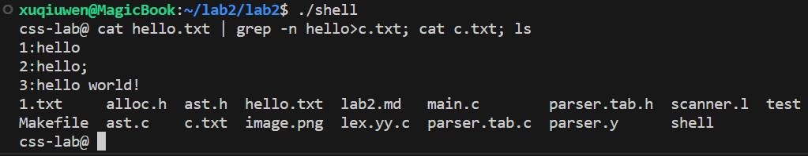
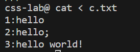

### Exercise 1
**答：**可以结合使用。管道可以将一个命令的输出传递给另一个命令作为输入，而后台命令可以使得命令在后台运行，不占据当前的终端或Shell。
[Alt text](image.png)
### Exercise 2
**答：**如果去掉 pid = wait((int *) 0); 这行代码，父进程就不会等待子进程结束，子进程可能成为孤儿进程，但是 linux 系统也会回收它。
### Exercise 3
**答：**可以，POSIX 标准中的 posix_spawn()和posix_spawnp()函数提供了fork和exec的组合功能。用于创建新的进程并执行指定的程序。
### Exercise 4
1. 首先，它创建了一个argv数组来存储要传递给cat命令的参数。
2. 使用fork()创建了一个子进程。在子进程中：
    1. 首先调用close(0);关闭了标准输入（文件描述符为0的文件）。
    2. 随后，使用open("input.txt", O_RDONLY);打开了名为input.txt的文件。由于我们刚刚关闭了文件描述符为0的文件（即标准输入），系统会为新打开的input.txt文件分配最小可用的文件描述符，也就是0。因此，现在input.txt成为了子进程的标准输入。
    3. 最后，使用exec("cat", argv);来执行cat命令。此时，cat命令会从其标准输入（也就是input.txt文件）读取数据。
### Exercise 5
dup(p[0]): 这一行会将p[0]复制到系统中最小的可用文件描述符。由于此时0（标准输入）还没有被关闭，所以dup函数会选择下一个可用的文件描述符，通常是 3。
close(0): 这一行接着关闭标准输入。
所以，调换后的结果是，p[0]会被复制到文件描述符 3，而不是标准输入。因为echo命令需要从标准输入读取数据，所以调换这两行代码的顺序会导致逻辑错误。
### Exercise 6
性能：管道允许数据在进程间直接传输，而无需先写入磁盘再从磁盘读出。对于大量数据或频繁的操作，使用管道通常比使用临时文件更快。
资源使用：临时文件会占用磁盘空间，即使它们只是短暂存在。而管道使用内存进行操作，不占用磁盘空间。
简洁性：管道提供了一种简洁的方式来连接两个进程，无需明确的文件名或管理临时文件的生命周期。
安全性：使用临时文件可能会泄露敏感信息，因为其他进程或用户可能可以访问这些文件。而管道是私有的，不易被其他进程访问。
并发性：通过管道，数据可以在被生产和消费时实时流动，这使得两个进程可以并发执行。而使用临时文件时，一个进程必须等待另一个进程完成文件写入后才能开始读取。
生命周期管理：使用临时文件可能需要开发者记住删除这些文件以避免资源泄露。而使用管道时，操作系统会负责资源的管理，当两边的进程都关闭管道时，资源会被自动回收。
### Exercise 7
见 ast.c
### Exercise 8
见 ast.c
### Exercise 9
见 ast.c

### Challenge
见 scanner.l、parser.y、ast.c
