### partA
#### Exercise 1
见 square.c
#### Exercise 2
见 pi.c
### partB
修改了如下代码
#define NUM_ITERATIONS 1000000
#### Exercise 1
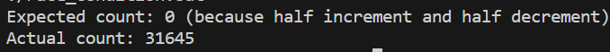
预期输出: 由于有一半的操作是增加计数器，另一半的操作是减少计数器，所以预期的输出是0。
实际输出: 由于多个线程并发执行而没有适当的同步机制，导致竞态条件。在这种情况下，两个或更多的线程可能会同时读取和修改计数器，导致计数不准确。
#### Exercise 2
见 mutex.c
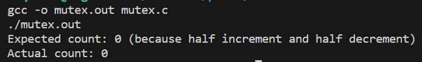
#### Exercise 3
见 spinlock.c
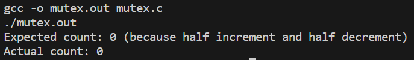
#### Exercise 4
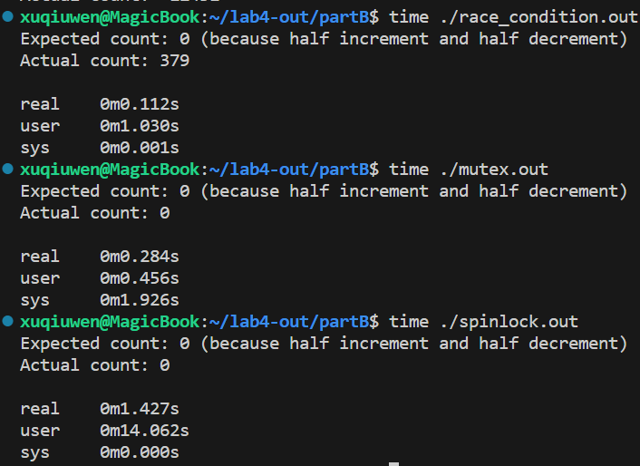
因此在此案例中，互斥量的执行效率更高
#### Exercise 5
见producer-consumer.c
### partC
#### Exercise 1
见 atomic.c
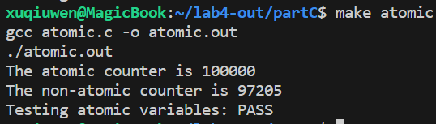
#### Exercise 2
见 spinlock.c
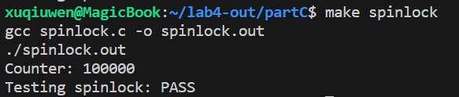
#### Exercise 3
见 sema.c
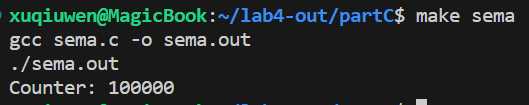
>仅用原子似乎实现不了等待队列
#### Challenge
见 cas.c
#### Challenge
在并发编程中，不同线程对内存的访问可能会以预料之外的方式重排序。这是因为编译器、处理器或硬件都可能对操作进行优化。为了提供更大的控制和确定性，C11的stdatomic.h引入了memory_order枚举，允许开发者指定原子操作的内存顺序语义。
* memory_order_relaxed:
仅保证原子操作本身不会被中断。没有对操作前后的其他读写操作的顺序提供任何保证。
* memory_order_consume:
通常用于确保某些操作读取的数据依赖于之前的操作，但在许多编译器中，其行为与memory_order_acquire相似或相同。
* memory_order_acquire:
防止其之后的读写操作被重新排序到它之前。通常用于读锁语义。
* memory_order_release:
防止其之前的读写操作被重新排序到它之后。通常用于写锁语义。
* memory_order_acq_rel:
结合了memory_order_acquire和memory_order_release的语义。即它前面的操作不会被重新排序到它后面，反之亦然。
* memory_order_seq_cst:
这是默认的内存顺序，提供最强的顺序保证。所有使用这个顺序的原子操作都按严格的顺序全局执行。这也是最昂贵的顺序选项。
### partD
#### Exercise 1
见 concur-stack.c
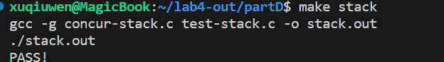
#### Exercise 2
见 concur-hash.c
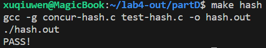
#### Challenge
见 concur-hash-little.c
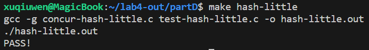
### PartE
#### Exercise 1
见 lf-stack.c
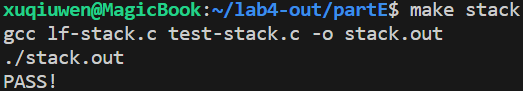
#### Exercise 2
见 lf-queue.c
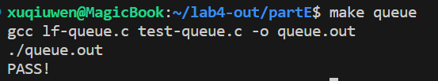