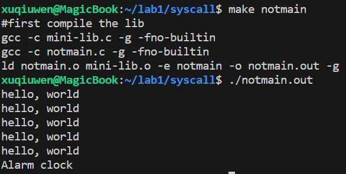
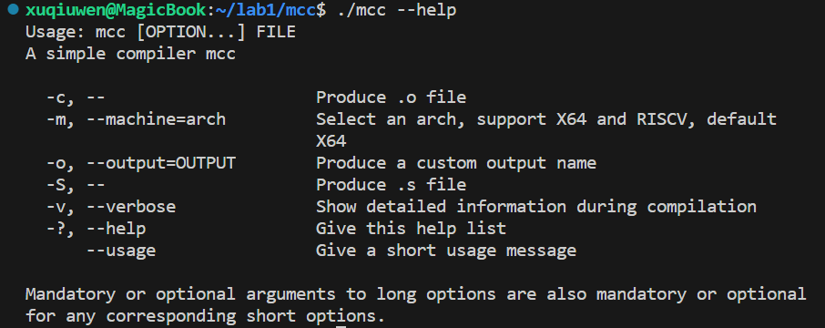
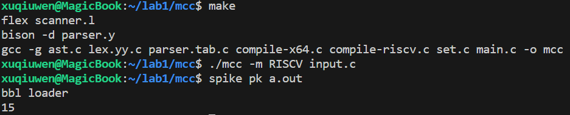

### Exercise 1
见 mini-lib.c 的 int puts(char *s)
### Exercise 2
见 mini-lib.c 的 void exit(int status)
### Exercise 3
见 mini-lib.c 和 notmain.out

### Challenge 
见 printf.c 的 int printf(char *fmt, ...)
### Challenge 
见 mini-lib.c 的 int sleep(struct timespec *, struct timespec *)
### Exercise 4
* -o 指定可执行文件的名称
* -S 生成汇编文件
* -c 生成二进制文件
* -m 选择系统平台 X86/RISCV
* -v 显示详细信息

`./mcc --help`

### Exercise 5
`./mcc -S input1.c`
* 赋值语句 a = a + 5:
movq %rax, a(%rip): 将 %rax 中的值存入变量 a。
movq a(%rip), %rax: 从变量 a 中读取值到寄存器 %rax。
push %rax: 将 %rax 的值压入堆栈。这是为了暂时 a的值。
movq $5, %rax: 将立即数 5 加载到寄存器 %rax。
pop %rbx: 从堆栈弹出值到寄存器 %rbx。现在，%rbx 存储了 a 值。
addq %rbx, %rax: 将 %rbx (a 值) 和 %rax (值为5) 相加，并将结果存储在 %rax。
movq %rax, a(%rip): 将 %rax 中的结果存入变量 a。现在，a 的值更新为 a + 5。
* 输出语句 print(a)
movq a(%rip), %rax: 从全局变量 a 中读取值到寄存器 %rax。
movq %rax, %rsi: 将 %rax 的值移动到 %rsi 寄存器。这是为了传递 printf 函数的参数。
leaq mcc_format(%rip), %rdi: 将 mcc_format 的地址加载到 %rdi。这是 printf 的格式字符串。
call printf: 调用 printf 函数输出 a 的值。
* 为什么要使用栈呢？
```s
Exp_Add e = (Exp_Add) exp;
            compile_exp(e->left);
            emit("\tpush %rax\n");
            compile_exp(e->right);
            emit("\tpop %rbx\n");
            emit("\taddq %rbx, %rax\n");
            break;
```
当计算完左侧的子表达式，需要将结果 push 存入 rax，防止在执行右侧的子表达式时将 rax 破坏，然后 pop 出 rbx。也就是说，rax 存的是右子表达式的值，rbx 存的是左子表达式的值。
* printf
```s
mcc_format: .string "%d\n"
	.globl main
	.type main, @function
```
实际上就是调用了 C 库的 printf，第一个参数为格式串地址，第二个参数为变量的值
### Exercise 6
见 compile-riscv.c

>仿造 compile-x64.c 实现
### Challenge
可以采用 LLVM 框架实现编译器的 JIT 后端
