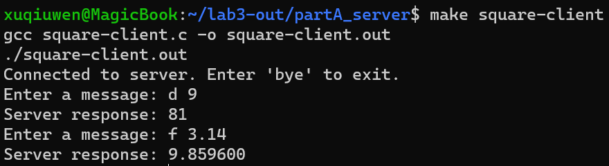
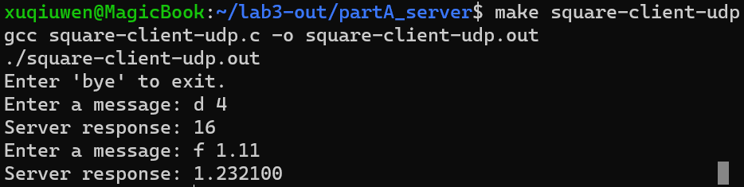
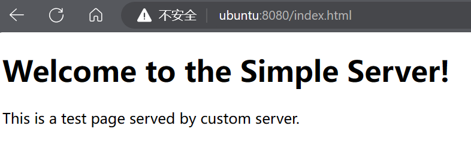
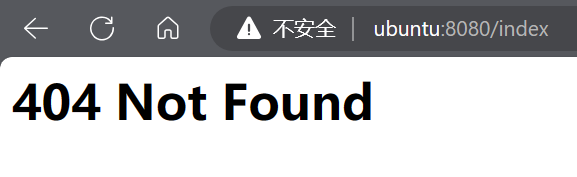
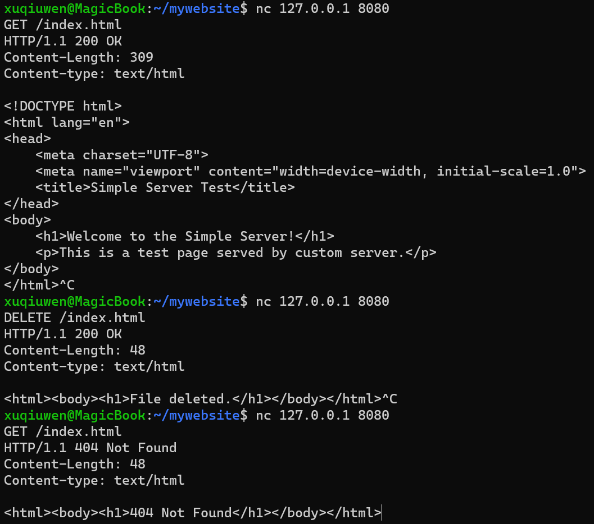
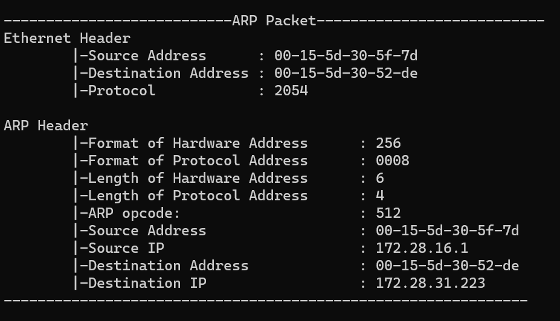
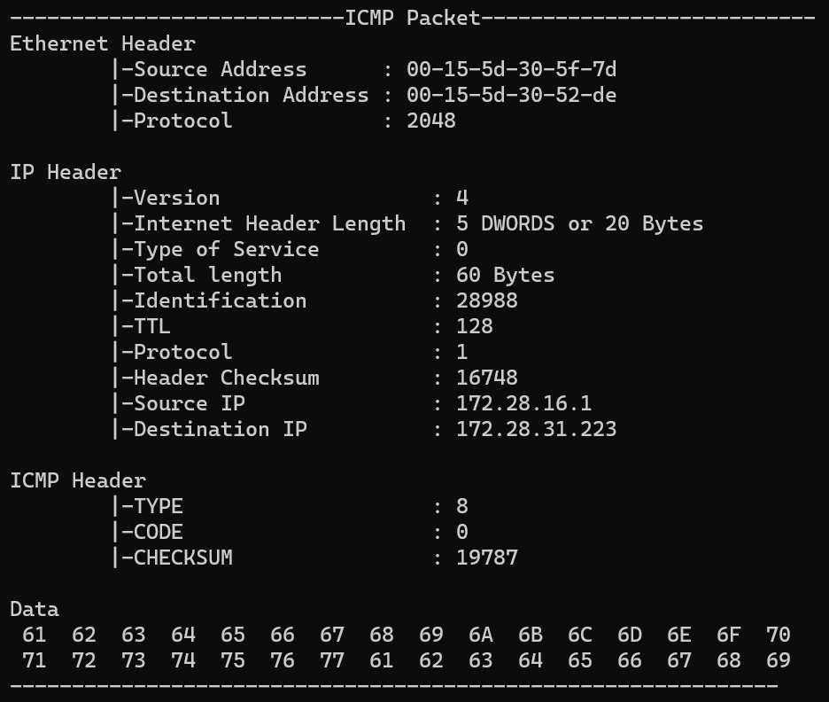
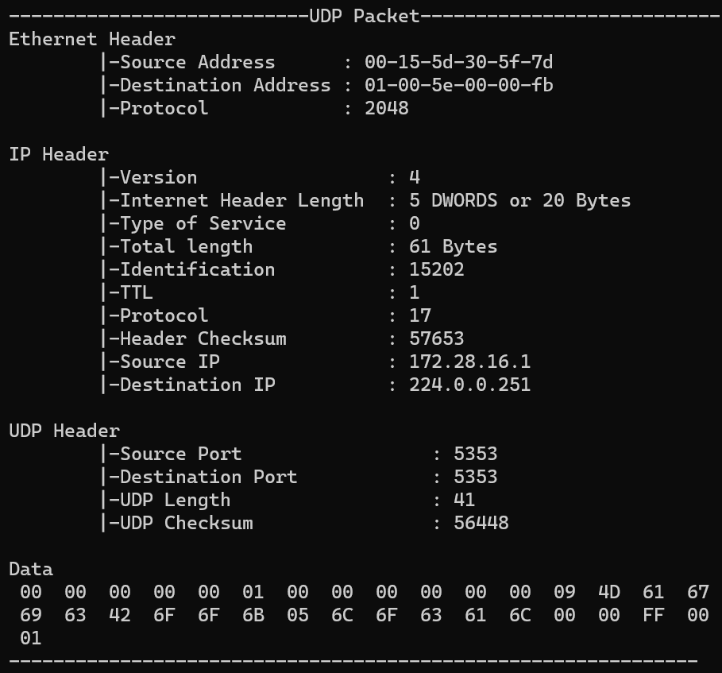
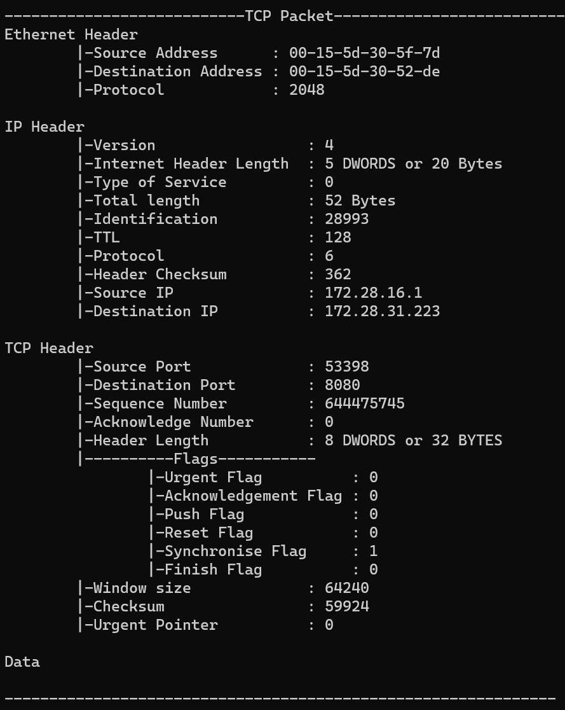

### Part A
#### Exercise 1
理解了
#### Exercise 2
理解了
#### Exercise 3
见 square-server.c
#### Exercise 4
见 square-server-extend.c

#### Challenge
UDP是不可靠的，所以必须手动处理可能的数据包丢失。可以使用重试机制通并设置超时以等待服务器的响应。
见 square-server-udp.c 和 square-client-udp.c

#### Exercise 5
见 web-server.c

#### Exercise 6
见 web-server.c

#### Challege
见 web-server.c
### Part B
#### Exercise 1
见 send_icmp.c
如果ICMP消息的校验和是错误的，那么在传输过程中，如果有路由器或防火墙检查ICMP校验和，可能就把这个消息丢弃了
算法如下：
1. 将校验和字段设置为0。
2. 将整个ICMP消息（头部和数据）划分为16位（2字节）的组。如果在最后有一个单独的字节，则将其与0填充成一个完整的16位值。
3. 将所有16位的值相加起来。
4. 将得到的总和中的溢出加回到结果的最低16位上。
5. 取最后总和的反码（即将所有比特翻转）。
#### Exercise 2
见 send_icmp.c
#### Challenge
见 send_icmp.c
使用 xor 进行加密解密，双方可以事先约定好 key = "this is a key"
### Part C
#### Exercise 1
promiscuous_main.c 为什么有 TODO ? 已补充，见 promiscuous_main.c
##### raw_init()
1. 创建原始套接字：
使用socket(PF_PACKET, SOCK_RAW, htons(ETH_P_ALL))创建了一个原始套接字。这使得应用程序可以收到所有类型的以太网帧。
2. 设备名字设置：
使用strcpy(ifr.ifr_name, device)将设备名复制到ifr结构体中，这样ioctl调用就知道对哪个设备进行操作。
3. 获取并设置混杂模式：
使用ioctl的SIOCGIFFLAGS命令获取设备的当前标志。
使用按位或操作将IFF_PROMISC标志添加到设备标志中，从而启用混杂模式。
使用ioctl的SIOCSIFFLAGS命令设置新的标志。
4. 获取设备索引：
使用ioctl的SIOCGIFINDEX命令获取设备的索引。检查是否配置成功。
##### clear_flag() 
1. 获取当前接口的标志:
使用 ioctl 函数和 SIOCGIFFLAGS 命令从给定的接口（通过 ifr.ifr_name 指定）获取当前的标志。
2. 清除 IFF_PROMISC 标志:
使用按位与（&）操作和按位取反（~）操作清除 ifr.ifr_flags 中的 IFF_PROMISC 标志。
3. 设置接口标志:
使用 ioctl 函数和 SIOCSIFFLAGS 命令将修改后的标志设置回接口。
#### Exercise 2
见 packet-process.c

#### Exercise 3
见filter.c
### Part D
#### Exercise 4
见 ARP-forge.c
#### Exercise 5
见 UDP-forge.c
#### Challenge
见 TCP-forge.c