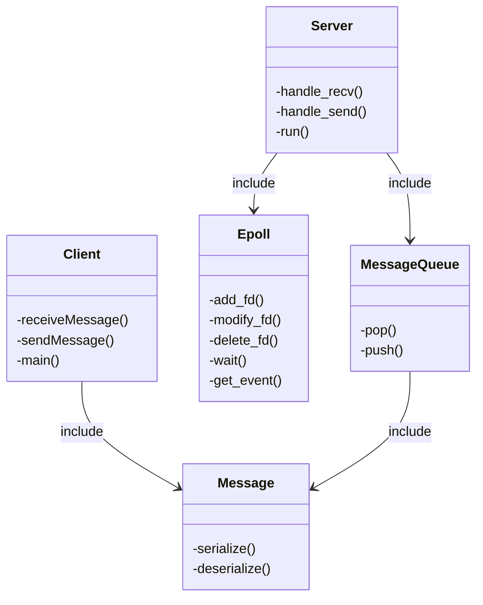
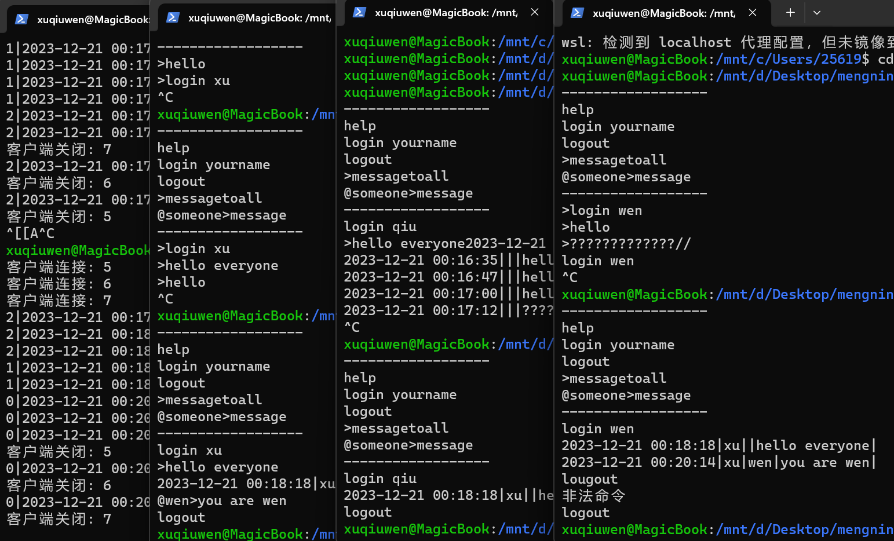

# 网络编程：探究高性能技术并用它实现一个简易聊天程序
## 高性能技术探究
### 多线程探究
多线程是一种常用的高性能计算方法，通过在多个处理器或多核处理器上并行执行程序的不同部分来提高性能。
* 工作原理：
  * 一个进程可以同时运行多个线程来执行不同的任务，每个线程可以运行在处理器的不同的核心上实现线程间并行。
* 优势：
  * 提高应用性能：允许同时执行多个操作。
  * 提高资源利用率，如 CPU 使用率。
* 挑战：
  * 线程安全：确保数据在多线程访问时不会导致冲突或错误。
  * 线程管理：合理分配线程数量，避免过多线程导致的上下文切换开销。
### Epoll 探究
Epoll 是一种在 Linux 系统中广泛使用的高效 I/O 事件通知机制，特别适合于处理大量的并发网络连接。它是对早期的 select 和 poll 系统调用的一种改进。
* 工作原理：
  它允许应用程序监控多个文件描述符，当这些文件描述符上有 I/O 事件发生时，它会通知应用程序。
* 优势：
  * Epoll 提供更好的扩展性，能够处理数千甚至数万个并发连接。
  * 不同于 select/poll 的轮询方式，epoll 通过事件通知机制，仅关注活跃的文件描述符。
* 挑战：
  * 复杂的事件处理：特别是在边缘触发模式下，需要仔细处理 I/O 操作。
  * 平台依赖性：仅在 Linux 系统中有效。
### 消息队列探究
* 基本概念：
消息队列提供了一个先进先出（FIFO）的数据结构，用于存储消息。
支持数据的异步处理，即生产者和消费者不需要同时在线。
* 优势：
  * 解耦：生产者和消费者的解耦使系统更易于扩展和维护。
  * 弹性缓冲：在生产者和消费者之间提供缓冲，帮助应对负载变化。
  * 异步通信：提高系统的响应性和吞吐量。
* 挑战：
  * 消息积压：需要监控队列长度，合理调整生产者和消费者的处理能力。
  * 顺序性和一致性：在设计时确保消息的顺序性和一致性，特别是在分布式环境中。
>看完多线程、Epoll 和消息队列的基本原理后，接下来用一个简易的项目深入理解一下
## 项目
### 项目概述
* 开发一个高性能、多用户的聊天服务器和客户端程序。
* 利用多线程、Epoll 和消息队列技术提高性能。
### 技术栈
* 编程语言：C++
* Socket 编程：建立网络连接和数据传输
* 多线程：分离输入流和输出流
* Epoll：Linux 的 I/O 多路复用技术
* 消息队列：组织和优化数据传输
### 功能
* 用户登录、登出
* 私聊：一对一的聊天
* 群聊：一对多的聊天
### 架构设计
* C-S 架构
* 面向对象、封装
  * Epoll
  * Message
  * MessageQueue
  * Server
  * Client

### 实现代码
#### Epoll
**linux 的 epoll 相关的系统调用**
* `int epoll_create1(int flags)`
用于在 Linux 系统中创建一个新的 epoll 实例。
  * 参数 
    * flags: 控制 epoll 实例的行为，常见的标志是 EPOLL_CLOEXEC。
  * 返回值
    * 成功：返回一个新的 epoll 实例的文件描述符。
    * 失败：返回 -1 并设置 errno。
* `int epoll_ctl(int epfd, int op, int fd, struct epoll_event *event);`
用于控制 epoll 文件描述符上的事件，如添加、修改或删除。
  * 参数
    * epfd: epoll 实例的文件描述符。
    * op: 操作类型（如 EPOLL_CTL_ADD, EPOLL_CTL_MOD, EPOLL_CTL_DEL）。
    * fd: 需要操作的文件描述符。
    * event: 指向 epoll_event 结构的指针。
  * 返回值
    * 成功：返回 0。
    * 失败：返回 -1 并设置 errno。
* `int epoll_wait(int epfd, struct epoll_event *events, int maxevents, int timeout);`
等待 epoll 实例上的一组文件描述符发生事件。
  * 参数
    * epfd: epoll 实例的文件描述符。
    * events: 指向 epoll_event 结构数组的指针，用于接收事件。
    * maxevents: events 数组可以接受的最大事件数。
    * timeout: 等待事件的最长时间（毫秒）。两个特殊的值
      * -1：无限等待，直到事件发生。
      * 0：立即返回，不等待事件发生。
  * 成功：返回准备就绪的文件描述符数量。
  * 失败：返回 -1 并设置 errno。
```C++
// Epoll.h
#ifndef EPOLL_H
#define EPOLL_H
#include <stdexcept>
#include <sys/epoll.h>
#include <unistd.h>
using namespace std;
class Epoll {
  private:
    int epoll_fd;                     // epoll的文件描述符
    int max_size;                     // 事件最大个数
    struct epoll_event *epoll_events; // epoll事件数组

  public:
    Epoll(); // 默认大小100
    Epoll(int max_size);
    ~Epoll();

    int add_fd(int fd, uint32_t events);    // 添加套接字
    int modify_fd(int fd, uint32_t events); // 修改套接字，这里用不上
    int delete_fd(int fd);                  // 删除套接字
    int wait(int timeout);                  // 等待事件
    epoll_event get_event(int index);       // 获取第i个事件
};

#endif
```
```C++
// Epoll.cpp
#include "Epoll.h"

Epoll::Epoll() : max_size(100) {
    epoll_fd = epoll_create1(0);
    if (epoll_fd == -1) {
        throw runtime_error("epoll_create1() error");
    }

    epoll_events = new epoll_event[max_size];
}

Epoll::Epoll(int max_size) : max_size(max_size) {
    epoll_fd = epoll_create1(0);
    if (epoll_fd == -1) {
        throw runtime_error("epoll_create1() error");
    }

    epoll_events = new epoll_event[max_size];
}

Epoll::~Epoll() {
    close(epoll_fd);
    delete[] epoll_events;
}

int Epoll::add_fd(int fd, uint32_t events) {
    struct epoll_event event;
    event.events = events;
    event.data.fd = fd;
    if (epoll_ctl(epoll_fd, EPOLL_CTL_ADD, fd, &event) == -1) {
        return -1;
    }
    return 0;
}

int Epoll::modify_fd(int fd, uint32_t events) {
    struct epoll_event event;
    event.events = events;
    event.data.fd = fd;
    if (epoll_ctl(epoll_fd, EPOLL_CTL_MOD, fd, &event) == -1) {
        return -1;
    }
    return 0;
}

int Epoll::delete_fd(int fd) {
    if (epoll_ctl(epoll_fd, EPOLL_CTL_DEL, fd, nullptr) == -1) {
        return -1;
    }
    return 0;
}

int Epoll::wait(int timeout) {
    int event_count = epoll_wait(epoll_fd, epoll_events, max_size, timeout);
    if (event_count == -1) {
        return -1;
    }
    return event_count;
}

epoll_event Epoll::get_event(int index) {
    return epoll_events[index];
}
```
#### Message
定义消息格式，实现序列化和反序列化方法。
```C++
// Message.h
#ifndef MESSAGE_H
#define MESSAGE_H
#include <sstream>
#include <string>
#include <vector>
using namespace std;
class Message {
  public:
    int type;       // 消息类型 0单发 1群发 2登录 3登出
    string time;    // 时间
    string from;    // 发送者
    string to;      // 接收者
    string content; // 消息
    Message() {}
    Message(int type, string time, string from, string to, string content);
    string serialize() const;             // 序列化
    void deserialize(const string &data); // 反序列化
};
#endif
```
```C++
// Message.cpp
#include "Message.h"

Message::Message(int type, string time, string from, string to, string content) : type(type), time(time), from(from), to(to), content(content) {
}

string Message::serialize() const {
    stringstream ss;
    ss << type << "|" << time << "|" << from << "|" << to << "|" << content << "|";
    return ss.str();
}

void Message::deserialize(const string &data) {
    stringstream ss(data);
    string item;
    vector<string> tokens;
    while (getline(ss, item, '|')) {
        tokens.push_back(item);
    }
    // std::cout << tokens[0] << tokens[1] << tokens[2] << tokens[3] << tokens[4] << endl;
    int type = stoi(tokens[0]);
    *this = Message(type, tokens[1], tokens[2], tokens[3], tokens[4]);
}
```
#### MessageQueue
消息队列的实现，把消息放到一个队列，用类封装起来，提供对外的 push 和 pop 方法。这里要注意消息队列的互斥访问，我采用互斥锁和消息队列实现。
```C++
// MessageQueue.h
#include "Message.h"
#include <condition_variable>
#ifndef MESSAGEQUEUE_H
#define MESSAGEQUEUE_H
#include <mutex>
#include <optional>
#include <queue>
using namespace std;
class MessageQueue {
  private:
    queue<Message> message_queue;
    mutable mutex mtx;
    condition_variable cond;

  public:
    void push(Message msg);
    Message pop();
    bool empty() const;
    size_t size() const;
};
#endif
```
```C++
// MessageQueue.cpp
#include "MessageQueue.h"
// 添加消息
void MessageQueue::push(Message msg) {
    lock_guard<mutex> lock(mtx);
    message_queue.push(move(msg));
    cond.notify_one();
}

// 获取消息
Message MessageQueue::pop() {
    unique_lock<mutex> lock(mtx);
    cond.wait(lock, [this] { return !message_queue.empty(); });
    Message msg = move(message_queue.front());
    message_queue.pop();
    return msg;
}

// 检查队列是否为空
bool MessageQueue::empty() const {
    lock_guard<mutex> lock(mtx);
    return message_queue.empty();
}

// 获取队列大小
size_t MessageQueue::size() const {
    lock_guard<mutex> lock(mtx);
    return message_queue.size();
}
```
#### Server
**加入多线程和消息队列**
服务器端的实现，使用两个线程，一个用来接收消息，另一个用来转发消息
* 接收消息的线程会把收到的来自客户端的消息放入消息队列
* 转发消息的线程从消息队列取出一条消息，然后根据消息内容的类型和接收者转发消息。达到了接收消息和转发消息的一个异步

**加入Epoll**
接收消息的线程，使用 epoll 对多个客户端连接的文件描述符进行监听，当接收到消息时，线程被唤醒，遍历epoll.wait返回的结构体数组指针可以获取到每一个发生的事件，对于每一个事件，获取到套接字描述符，再由套接字描述符从接收缓存中取出消息，根据消息类型处理该消息，处理完成之后，等待下一此唤醒。这样就使线程高效(相对于其他的多路复用机制、epoll本身的优势)的处理多路连接请求和接收消息
```C++
// Server.cpp
#include "Epoll.h"
#include "Message.h"
#include "MessageQueue.h"
#include <cstring>
#include <iostream>
#include <netinet/in.h>
#include <queue>
#include <sys/epoll.h>
#include <sys/socket.h>
#include <thread>
#include <unistd.h>
#include <unordered_map>
#define EPOLL_SIZE 1000
#define BUF_SIZE 1000
using namespace std;
class Server {
  private:
    int listen_sock;                      // 监听套接字
    struct sockaddr_in serv_addr;         // 服务器地址(协议+IP+端口)
    Epoll epoll;                          // epoll
    MessageQueue msg_que;                 // 消息队列
    unordered_map<string, int> name_sock; // 在线用户名字、sock

    void handle_recv(); // 处理新连接和接收消息
    void handle_send(); // 处理发送消息
  public:
    Server(int port);
    Server(const char *port);
    int run();
};

Server::Server(const char *port) : epoll(EPOLL_SIZE) {
    memset(&serv_addr, 0, sizeof(serv_addr));
    serv_addr.sin_family = AF_INET;
    serv_addr.sin_addr.s_addr = INADDR_ANY;
    serv_addr.sin_port = htons(atoi(port));
}

int Server::run() {

    if ((listen_sock = socket(AF_INET, SOCK_STREAM, 0)) == 0) {
        cout << "socket() error" << endl;
        return -1;
    }
    if (bind(listen_sock, (struct sockaddr *)&serv_addr, sizeof(serv_addr)) < 0) {
        cout << "bind() error" << endl;
        return -1;
    }
    if (listen(listen_sock, 5) < 0) {
        cout << "listen() error" << endl;
        return -1;
    }

    // cout << "listen() seuccess" << endl;
    thread connection_thread = thread([this]() { this->handle_recv(); });
    thread message_thread = thread([this]() { this->handle_send(); });

    connection_thread.join();
    message_thread.join();
    return 0;
}

void Server::handle_recv() {
    epoll.add_fd(listen_sock, EPOLLIN);
    int data_sock;

    while (1) {

        int event_cnt = epoll.wait(-1);
        if (event_cnt == -1) {
            puts("epoll_wait() error");
            break;
        }
        for (int i = 0; i < event_cnt; i++) {
            int cur_fd = epoll.get_event(i).data.fd;
            struct sockaddr_in clnt_addr;
            socklen_t clnt_addr_size;
            if (cur_fd == listen_sock) { // 新连接到达
                clnt_addr_size = sizeof(clnt_addr);
                data_sock = accept(listen_sock, (struct sockaddr *)&clnt_addr, &clnt_addr_size);
                epoll.add_fd(data_sock, EPOLLIN);
                printf("客户端连接: %d\n", data_sock);
            } else {
                char buf[BUF_SIZE];
                int str_len = read(cur_fd, buf, BUF_SIZE);
                cout << buf << endl;
                if (str_len == 0) { // 连接关闭
                    epoll.delete_fd(cur_fd);
                    close(cur_fd);
                    printf("客户端关闭: %d\n", cur_fd);
                } else { // 处理接收消息逻辑
                    Message msg;
                    msg.deserialize((string)buf);
                    // cout << msg.type;
                    if (msg.type == 2) { // 登录消息
                        name_sock.insert({msg.from, cur_fd});
                        // cout << msg.from << "登录" << endl;
                    } else if (msg.type == 3) { // 登出消息
                        name_sock.erase(msg.from);
                    } else {
                        msg_que.push(msg);
                    }
                }
            }
        }
    }
}

void Server::handle_send() {
    while (1) {
        while (!msg_que.empty()) {
            Message msg = msg_que.pop();
            cout << msg.serialize().c_str() << endl;
            char buf[BUF_SIZE];
            snprintf(buf, BUF_SIZE, "%s", msg.serialize().c_str());
            if (msg.type == 0) { // 单发
                write(name_sock[msg.to], buf, strlen(buf));
            } else if (msg.type == 1) { // 群发
                for (const auto &pair : name_sock) {
                    write(pair.second, buf, strlen(buf));
                }
            } else {
                cout << "消息类型错误" << endl;
            }
        }
    }
}

int main(int argc, char *argv[]) {

    if (argc != 2){
        printf("Usage : %s <port>\n", argv[0]);
        exit(1);
    }
    Server server(argv[1]);
    server.run();
}
```
#### Client
一个简易的客户端程序，实现了几条基本的命令，用于测试服务器的功能。为了能同时发送消息和接收消息，和服务器一样，利用两个线程，一个负责接收用户输入并发送消息，另一个负责接收服务器推送的消息并打印出来。
```C++
// Client.cpp
#include "Message.h"
#include <arpa/inet.h>
#include <chrono>
#include <iomanip>
#include <iostream>
#include <sstream>
#include <stdio.h>
#include <stdlib.h>
#include <string.h>
#include <sys/socket.h>
#include <thread>
#include <unistd.h>
#define BUF_SIZE 1000
using namespace std;

string getTime() {
    // 获取当前时间点
    auto now = chrono::system_clock::now();
    // 转换为 time_t 对象
    time_t now_time_t = chrono::system_clock::to_time_t(now);
    // 转换为 tm 结构
    tm now_tm = *localtime(&now_time_t);
    // 创建字符串流
    stringstream ss;
    // 使用流来格式化日期和时间
    ss << put_time(&now_tm, "%Y-%m-%d %H:%M:%S");
    // 获取格式化的字符串
    string datetime_str = ss.str();
    return datetime_str;
}

void receiveMessage(int sock) {
    char buf[BUF_SIZE];
    int str_len;

    while (1) {
        str_len = read(sock, buf, BUF_SIZE - 1);
        if (str_len == -1 || str_len == 0) {
            break; // 读取失败或者连接关闭
        }
        buf[str_len] = 0;
        cout << &buf[2] << endl;
    }
}

void sendMessage(int sock, string &name) {

    char buf[BUF_SIZE];
    string input;
    Message msg;

    while (true) {
        getline(cin, input); // 使用 getline 读取整行输入

        if (input == "help") {
            cout << "------------------\n"
                 << "help\n"
                 << "login yourname\n"
                 << "logout\n"
                 << ">messagetoall\n"
                 << "@someone>message\n"
                 << "------------------\n";
        } else if (input.substr(0, 6) == "login ") {
            name = input.substr(6);
            msg = Message(2, getTime(), name, "", "");
            // printf("Login as %s", name.c_str());
        } else if (input == "logout") {
            msg = Message(3, getTime(), name, "", "");
            // snprintf(buf, BUF_SIZE, "Logout");
        } else if (input[0] == '>') {
            string message = input.substr(1);
            msg = Message(1, getTime(), name, "", message);
            // snprintf(buf, BUF_SIZE, "Broadcast message: %s", message.c_str());
        } else if (input[0] == '@') {
            size_t pos = input.find('>');
            if (pos != string::npos) {
                string to = input.substr(1, pos - 1);
                string message = input.substr(pos + 1);
                msg = Message(0, getTime(), name, to, message);
                // snprintf(buf, BUF_SIZE, "Private message to %s: %s", name.c_str(), message.c_str());
            } else {
                cout << "非法命令" << endl;
                continue;
            }
        } else {
            cout << "非法命令" << endl;
            continue;
        }
        snprintf(buf, BUF_SIZE, "%s", msg.serialize().c_str());
        write(sock, buf, strlen(buf));
    }
}

int main(int argc, char *argv[]) {
    int sock;
    char message[BUF_SIZE];
    int str_len;
    struct sockaddr_in serv_adr;

    if (argc != 3) {
        printf("Usage : %s <IP> <port>\n", argv[0]);
        exit(1);
    }

    sock = socket(PF_INET, SOCK_STREAM, 0);
    if (sock == -1) {
        cout << "socket() error" << endl;
        return -1;
    }

    memset(&serv_adr, 0, sizeof(serv_adr));
    serv_adr.sin_family = AF_INET;
    serv_adr.sin_addr.s_addr = inet_addr(argv[1]);
    serv_adr.sin_port = htons(atoi(argv[2]));

    if (connect(sock, (struct sockaddr *)&serv_adr, sizeof(serv_adr)) == -1) {
        cout << "connect() error" << endl;
        perror(" ");
        return -1;
    }

    cout << "------------------\n"
         << "help\n"
         << "login yourname\n"
         << "logout\n"
         << ">messagetoall\n"
         << "@someone>message\n"
         << "------------------\n";

    string name;
    thread recv_thread(receiveMessage, sock);
    thread send_thread(sendMessage, sock, ref(name));

    send_thread.join();

    Message msg(3, getTime(), name, "", "");
    close(sock);
    return 0;
}

```
### 项目运行
**编译服务器代码**
```
g++ Server.cpp Message.cpp MessageQueue.cpp Epoll.cpp -o server.out
```
**启动一个服务器**
```
./server.out 8888
```
**编译客户端代码**
```
g++ Client.cpp Message.cpp -o client.out
```
**启动一个客户端**
```
./client.out 127.0.0.1 8888
```
### 运行结果

### 心得体会
网络程序设计这门课程，由孟宁老师主讲，不仅为我打开了网络编程的大门，更在这个过程中深化了我的理解和实践能力。课程内容涉及了从 JavaScript 网络编程到 Socket API，再到网络协议设计及远程过程调用（RPC），以及对 Linux 内核网络协议栈的深入探索，每一部分都是信息量巨大且实用的。
特别是在 Socket API 的实验中，我获益匪浅。这不仅仅是一个编程练习，更是一个思考通信机制和网络架构的机会。这部分的学习不仅使我掌握了网络编程的基本技能，而且对如何构建高效、可靠的网络应用有了更深入的理解，感受到了高性能网络编程的重要性和魅力。
孟宁老师的授课方式生动而充满激情，深入浅出地阐释了复杂的概念，使它们变得易于理解。老师每周对实验的检查和指导，不仅确保了学习进度，而且在很大程度上提高了我的学习兴趣和动力。这种持续的关注和支持，让我在遇到困难时能够及时获得帮助，并激发了我深入探索的热情。
总的来说，这门课程不仅提供了丰富的理论知识，更重要的是提供了实际操作的机会，使我能够将理论应用于实践。我衷心感谢孟宁老师的辛勤付出和悉心指导，这段学习经历无疑是我职业生涯中的一笔宝贵财富。